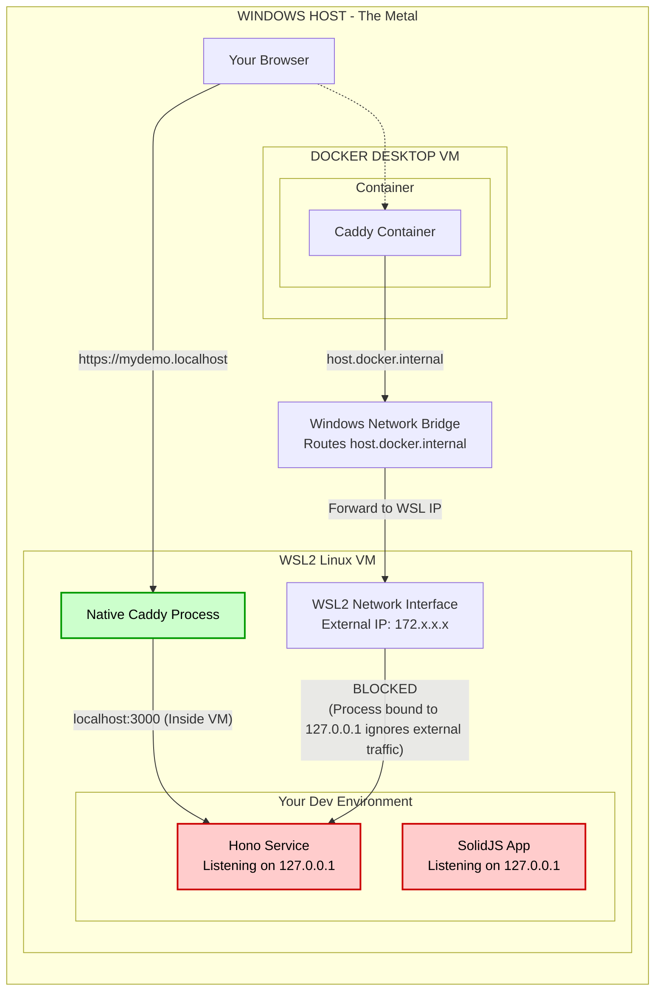

# Infra

## Local development

Local development (e.g. in WSL2):

    caddy run --config local/Caddyfile

In another shell, run:

    pnpm dev

Then go to:

    https://mydemo.localhost/                 # to apps/webapp
    https://mydemo.localhost/time             # served from the Caddyfile directly
    https://mydemo.localhost/api/             # to svcs/apisvc
    https://mydemo.localhost/api/add?a=2&b=2
    https://mydemo.localhost/api/hello
    https://mydemo.localhost/api/hello?name=world

## WIP: Containers - does not yet work, do not use.

in one shell:

    docker compose up

separate window:

    cd /c/temp  # or anywhere
    docker cp local-proxy:/data/caddy/pki/authorities/local/root.crt .

Double-click the certificate file to open the Windows Certificate Import Wizard.
Click "Install Certificate" and select "Local Machine".
Choose "Place all certificates in the following store" and click "Browse".
Select the "Trusted Root Certification Authorities" store and click "OK".

A Gemini-generated diagram that may not be 100% correct:

